# Personal Portfolio | Raymond Singlaire

A high-performance, interactive portfolio built with **React**, **Vite**, and **Three.js**. This project serves as a technical showcase of my journey from low-level C++ systems to modern full-stack web and mobile application development.

---

## Project Description

This portfolio is far more than a static digital resume; it is an interactive ecosystem designed to showcase the intersection of low-level systems engineering and high-fidelity web performance. Built with **React** and **Vite**, the site serves as a technical sandbox where Cyber-Minimalist aesthetics meet complex frontend logic.

From a custom 3D Three.js navigation system to a physics-integrated project grid, every element is built to demonstrate a "Systems-First" approach to web development. The architecture leverages a centralized **CSS Variable Engine**, allowing the entire UI, including 3D models and interactive sprites to pivot seamlessly between a deep-space Dark Mode (Cyan accents) and a high-clarity Light Mode (Deep Blue accents).

---

## Core Feature Suite

### 1. Interactive 3D Identity & Navigation
* **Three.js "Oiiai" Logo:** A high-performance 3D canvas integrated into the header. The legendary cat logo features a 3D perspective flip animation and is fully theme-aware, responding to user clicks and hover states.
* **Sticky Glassmorphism Header:** A frosted-glass navigation bar utilizing `backdrop-filter: blur(10px)` and a 3-column grid for balanced layout across all device sizes.
* **Active Route Tracking:** A smart navigation system that visually highlights your current location in the application with dynamic border-bottom transitions.

### 2. Dynamic Project Engine (Photogrid)
* **Real-time Multi-Criteria Search:** A high-speed search implementation using `useMemo` that filters projects instantly by title, description, or specific technology stack.
* **Domain-Driven Categorization:** An automated "Tech Pill" system that color-codes skills into three distinct engineering domains:
    * **Systems (Deep Orange):** C, C++, C#, SQL, and Low-level architecture.
    * **Web (Teal):** React, JavaScript, Vite, and Modern Frontend.
    * **Logic (Deep Green):** Python, Node.js, Flask, and Backend logic.
* **The "Khanfused" Easter Egg:** A custom animation trigger on the Khanfused project card that initiates a "Live Stream" overlay, sending 50 randomized Among Us crewmates floating across the screen with staggered CSS delays.

### 3. Professional Career Architecture
* **Vertical Timeline Engine:** A custom-styled experience log featuring a unique "cut-out" dot effect precisely aligned to a vertical axis, documenting your transition from CFM Holdings to Red Alpha Cybersecurity.
* **Photography Showcase:** A dedicated gallery grid designed for food styling and action photography, featuring "lift-on-hover" cards and optimized image loading.
* **Integrated CV Access:** A dedicated, high-visibility action button in the header for instant resume retrieval, styled to match the current theme's accent color.

### 4. Gamified Interaction (The Oiiai Game)
* **State-Driven Whack-a-Mole:** A fully functional 2x2 mini-game built into the portfolio. It features random interval logic, sprite pop-in animations, and real-time score tracking.
* **Overlay System:** A custom modal system for game starts and "Game Over" states, utilizing backdrop blurs to keep the focus on the interaction.

### 5. Communication & Email Systems
* **Email Integration Ready Form:** A sophisticated, state-controlled contact form built to capture Name, Email, Subject, and Message. It features real-time validation and a `handleSubmit` architecture designed for seamless integration with services like EmailJS.
* **Professional Direct-to-Mail:** For immediate inquiries, the Footer and Contact Info sections feature a direct mailto link to `raymond.singlaire@redalphacyber.com`. This ensures a frictionless communication path across all devices.
* **Interactive Input Glow:** All form fields utilize a custom focus-glow effect that shifts color based on your current theme (Deep Orange in Dark Mode), providing high-contrast visual feedback as the user types.
* **Social Connectivity Wrapper:** A dedicated cluster of animated icons for GitHub (**Fakerayray**) and LinkedIn, integrated alongside a smooth "Scroll to Top" utility for quick navigation.

---

## Setup and Installation

### Prerequisites
Ensure you have the following installed:
* **Node.js** (v18.0.0 or higher recommended)
* **npm** (comes with Node)

1.  **Clone the Repository**
    ```bash
    git clone [https://github.com/Fakerayray/portfolio-website.git]
    cd portfolio-website
    ```

2.  **Install Dependencies**
    ```bash
    npm install
    ```

3.  **Environment Setup**
    Create a `.env` file in the root directory:
    ```env
    VITE_EMAILJS_SERVICE_ID=your_service_id
    VITE_EMAILJS_TEMPLATE_ID=your_template_id
    VITE_EMAILJS_PUBLIC_KEY=your_public_key
    ```

4.  **Run the Development Server**
    ```bash
    npm run dev
    ```
    Once started, open your browser and navigate to: `http://localhost:5173`

---

## Troubleshooting
* **3D Logo not appearing?** Ensure your browser supports WebGL and that you have installed `@react-three/fiber` and `three`.
* **Icons missing?** Double-check that `@fortawesome/react-fontawesome` and the brand/solid SVGs are in your `package.json`.

---

## Screenshots

### Figure 1. Header/Home Light Mode
> **Easter egg:** spam click cat icon to make it spin super fast. Click beside it to stop.
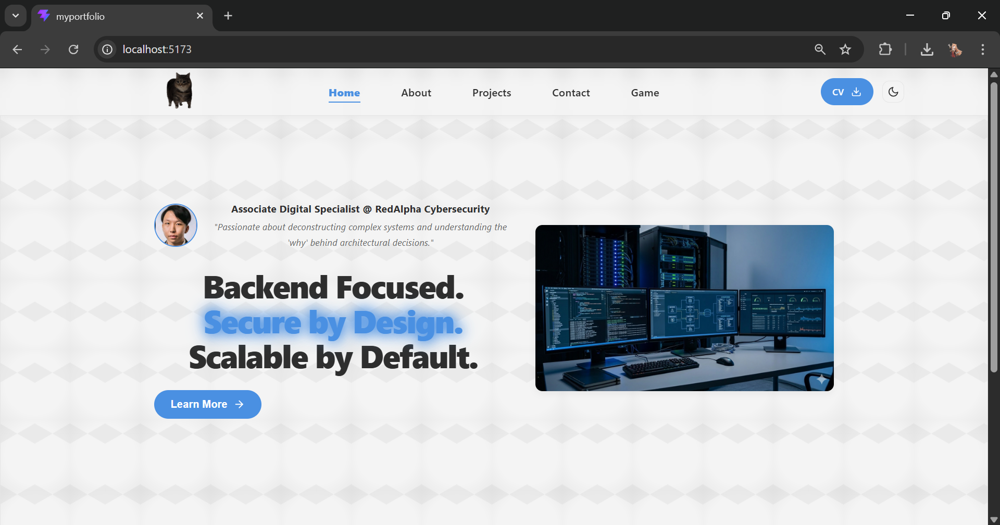

### Figure 2. Header/Home Night Mode
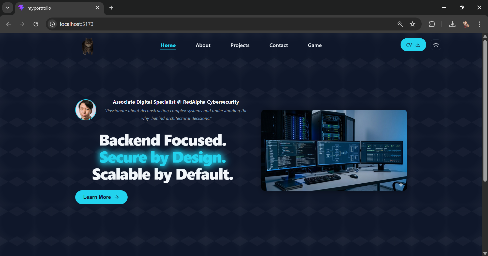

### Figure 3. Footer/Home Light Mode
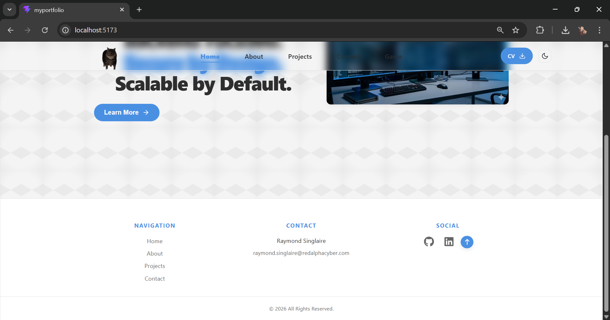

### Figure 4. Footer/Home Night Mode
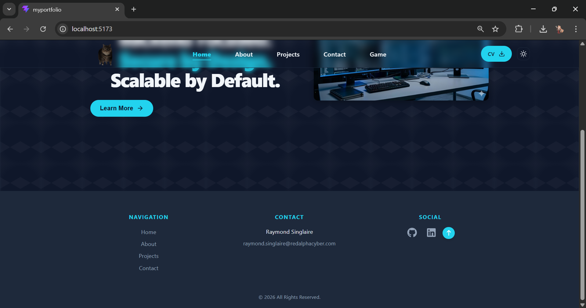

### Figure 5-7. About Light Mode
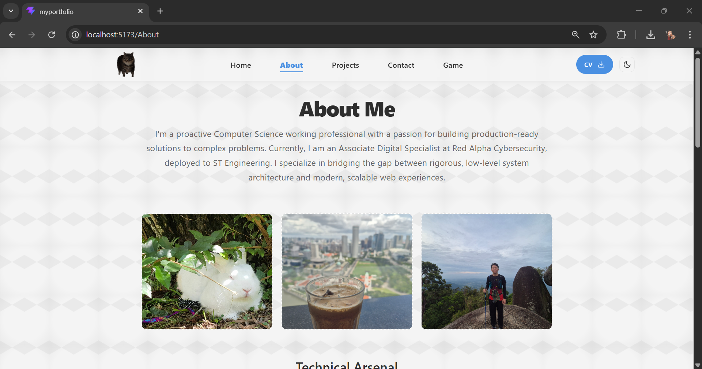
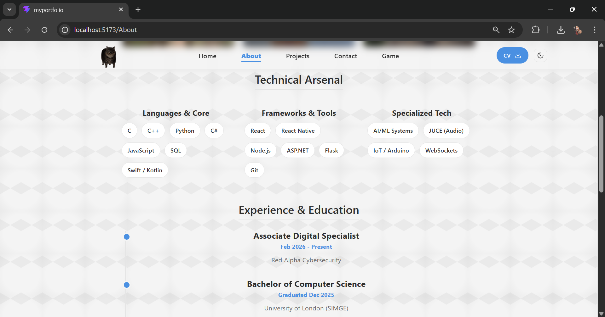
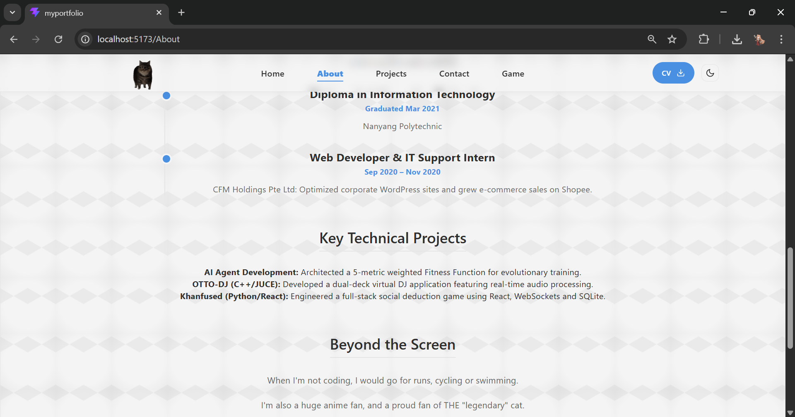

### Figure 8-10. About Night Mode
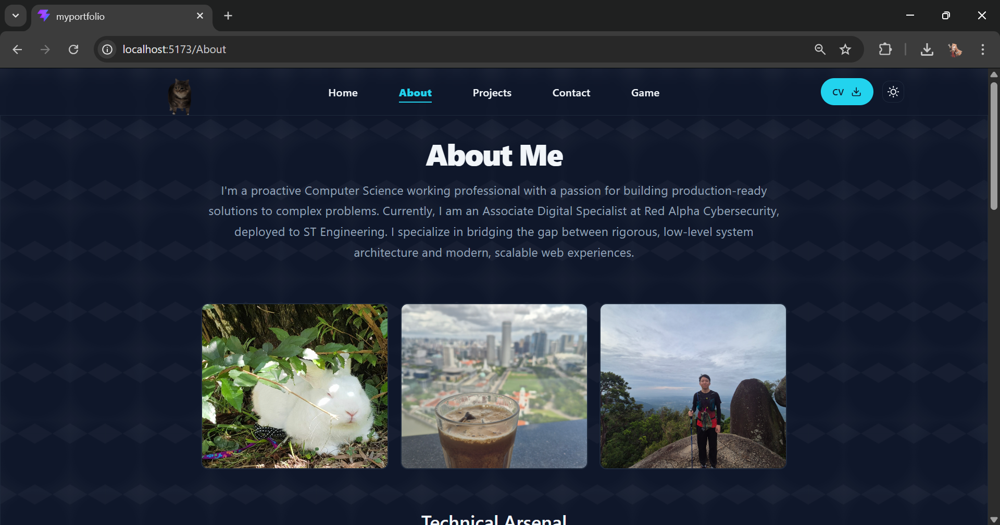
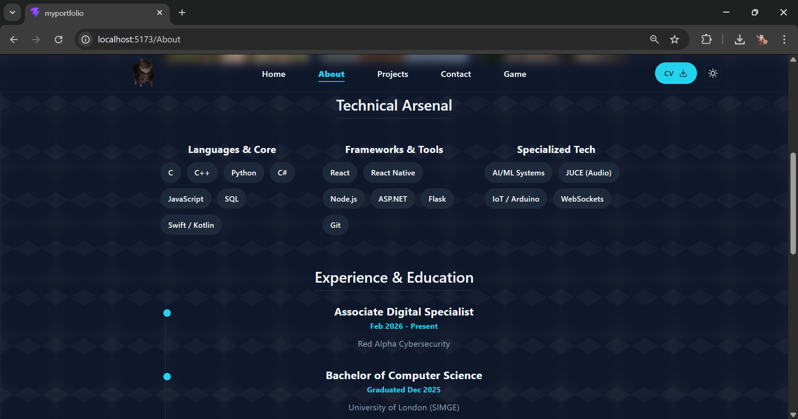
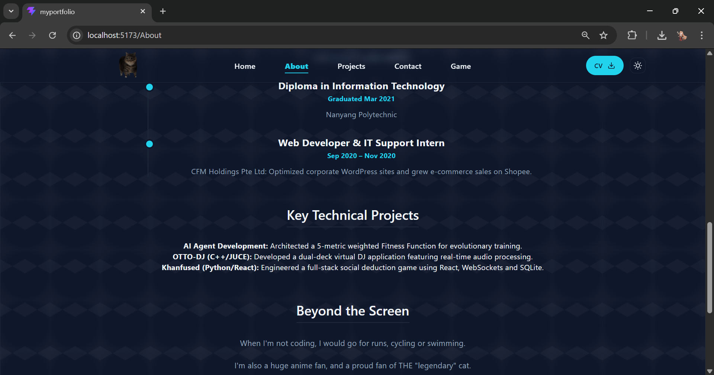

### Figure 11-12. Projects Light Mode
> **Easter Egg:** Click on the among us image for a special surprise!
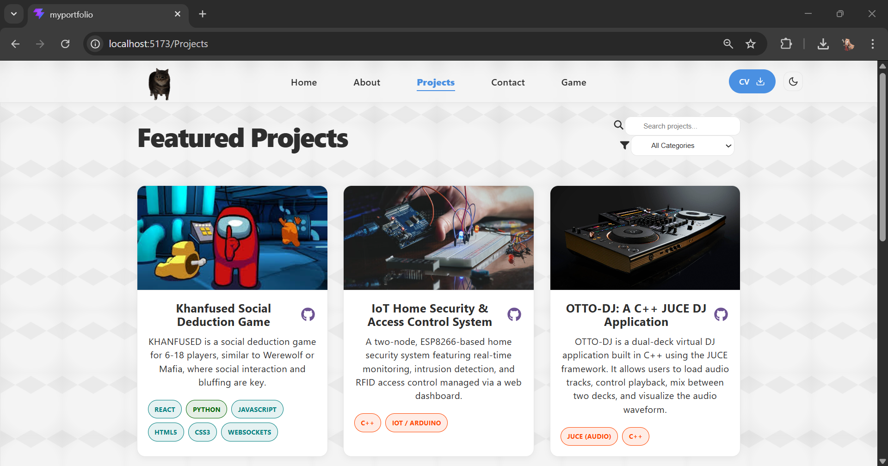
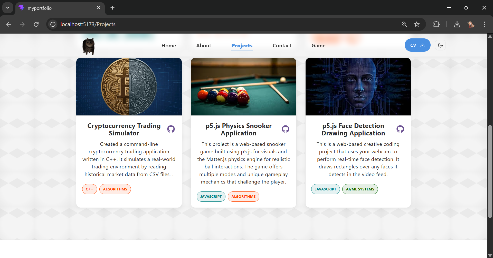

### Figure 13-14. Projects Night Mode
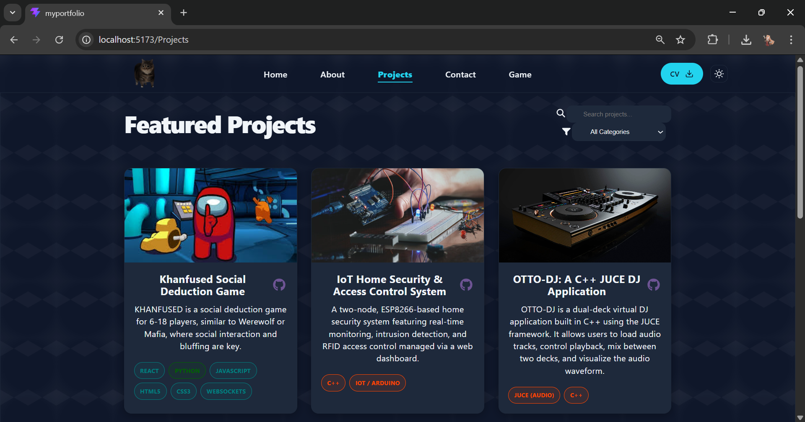
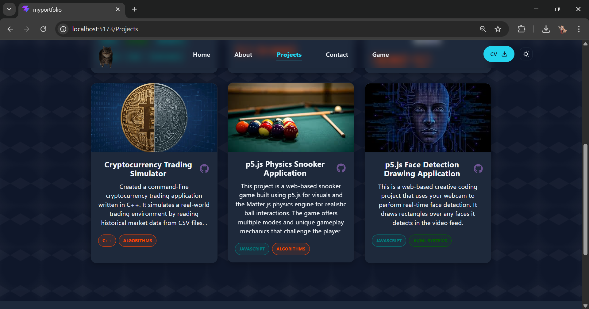

### Figure 15. Contact Day Mode
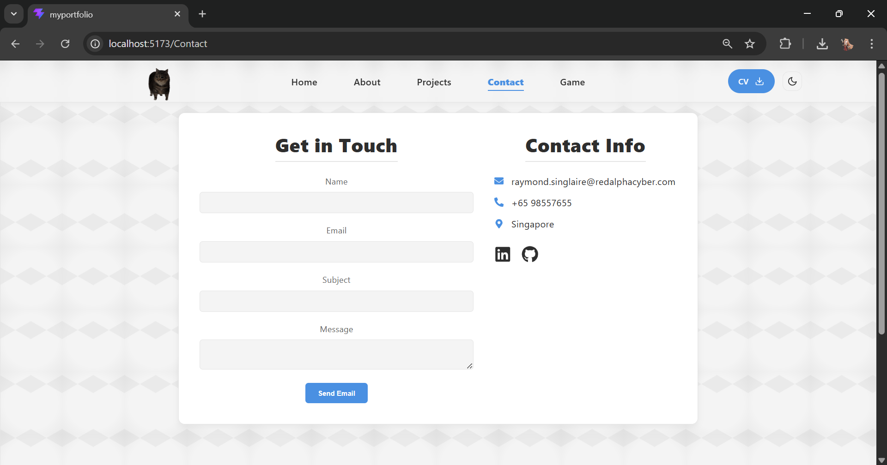

### Figure 16. Contact Night Mode
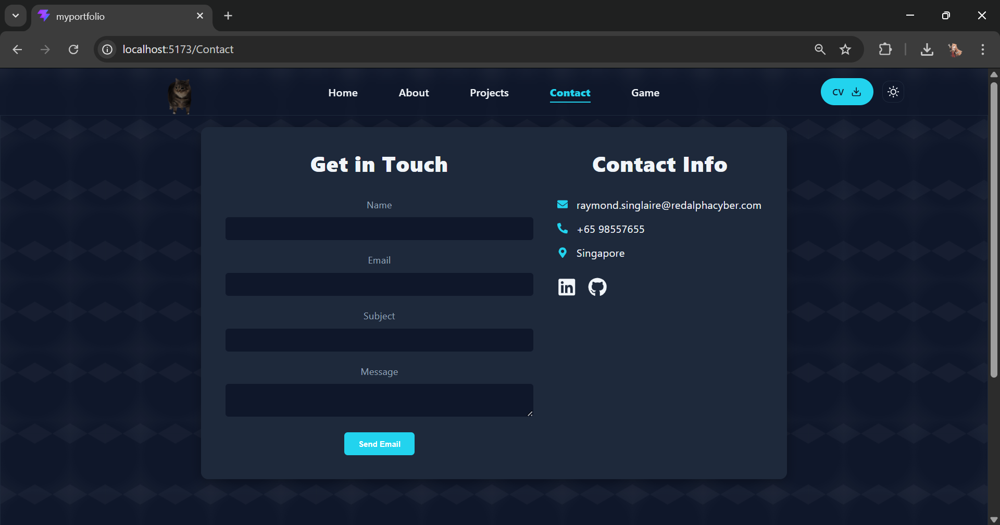

### Figure 17-18. Game Day Mode
> **Easter Egg:** Cursor is a hammer to simulate actual smacking.
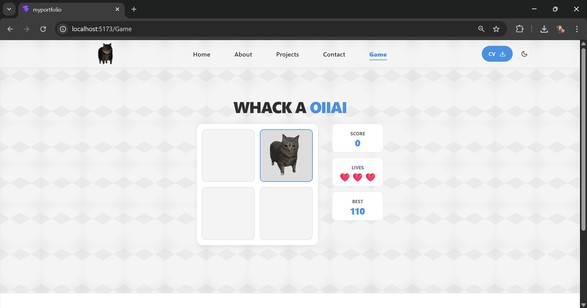
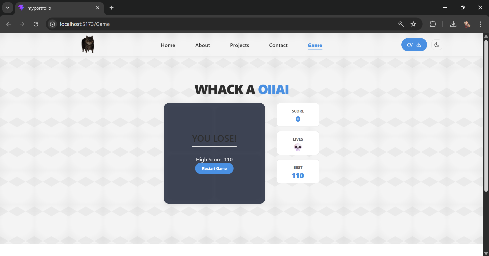

### Figure 19-20. Game Night Mode
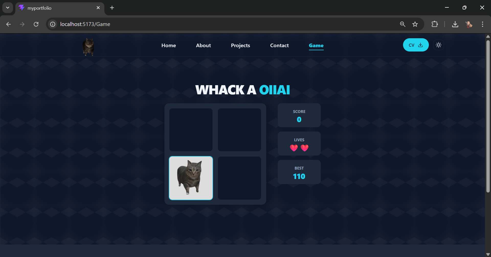
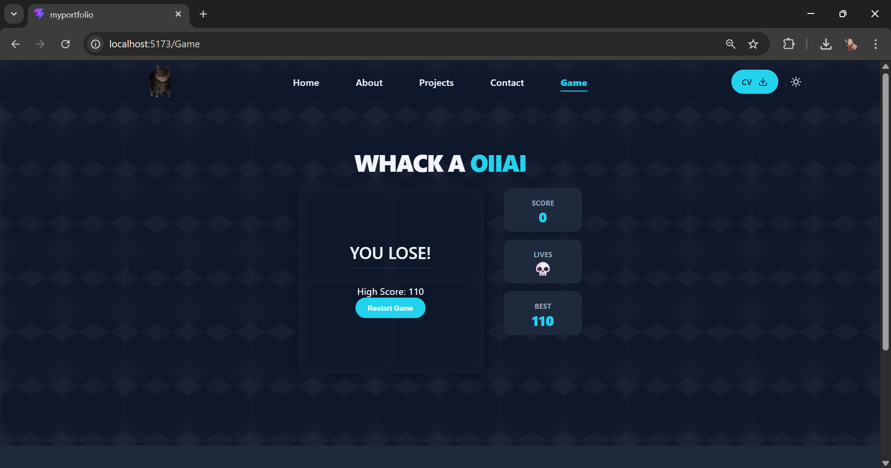
